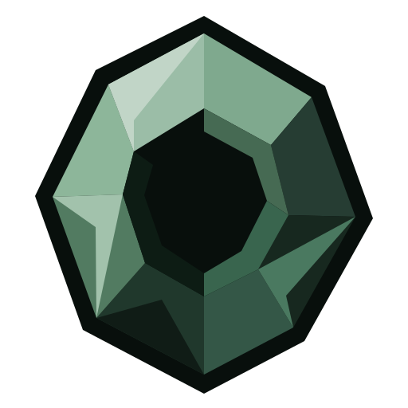

# Onyx



One window that installs, updates, downgrades and removes every RitoShark plugin.

Each plugin used to ship its own installer, PowerShell script or copy-these-files
instructions, and every release meant following them again. Onyx replaces all of that.

## What it manages

| Plugin | Host |
|---|---|
| RitoTex for Photoshop | Photoshop, every installed year |
| Paint.NET .tex | Paint.NET, classic and Store builds |
| GIMP 2 .tex | GIMP 2.10 |
| GIMP 3 .tex | GIMP 3 |
| RitoShark for Maya | Maya 2023 and newer |
| Aventurine for Blender | Blender, every installed version |
| .tex Explorer thumbnails | Windows Explorer |

## How it works

- **Finds your installs.** Detection reads the registry and each host's own
  configuration directory, so plugins on a second drive or a portable copy are found
  rather than guessed at. Anything it misses, you can point at by hand.
- **Every version, not just the latest.** Each row lists the plugin's whole release
  history. Picking an older one installs exactly that release — a downgrade takes the
  same path as an upgrade.
- **Won't corrupt a running host.** If Photoshop, Maya, Blender or GIMP is open, Onyx
  stops and offers to close it gracefully. It never force-quits anything holding your
  unsaved work.
- **Clean uninstall.** Onyx records the exact files it wrote and removes precisely those.
  It never deletes by pattern or guesses at a plugin's filenames.
- **Asks for admin only when it must.** Blender, Maya, GIMP and the thumbnail handler
  install per-user with no prompt at all. Only Photoshop and classic Paint.NET, which
  live under Program Files, need one.

## Adding a plugin

A plugin is an entry in [`catalog.json`](Onyx.Core/Catalog/catalog.json), not code:

```json
{
  "id": "aventurine-blender",
  "name": "Aventurine for Blender",
  "summary": "Native Blender addon for League models, animations and map geometry.",
  "repo": "RitoShark/Aventurine-League-Tools",
  "host": "blender",
  "asset": "Aventurine-*.zip",
  "steps": [
    { "verb": "copyDir", "from": "Aventurine", "to": "{host}/scripts/addons/Aventurine" }
  ]
}
```

Onyx fetches this file at launch, so a new plugin reaches everyone who already has the
app — no new build, no re-download.

The install engine understands four verbs and no more: `copy`, `copyDir`, `regsvr32`
and `sha256`. That is deliberate — a catalog cannot become a scripting language.

## Building

```
dotnet test
dotnet run --project Onyx
dotnet publish Onyx/Onyx.csproj -c Release -r win-x64 --self-contained -p:PublishSingleFile=true -o publish
```

The published `Onyx.exe` is self-contained: no .NET runtime to install first.

## Appearance

Onyx uses a neutral charcoal theme with muted sage accents, alongside the faceted mineral
identity of Flint, Hematite and Quartz. Theme colors live in
[`Onyx/Theme/Onyx.xaml`](Onyx/Theme/Onyx.xaml).

The logo source is [`onyx-logo.svg`](Onyx/Assets/onyx-logo.svg). After editing it, run
`powershell -NoProfile -ExecutionPolicy Bypass -File scripts/Build-BrandAssets.ps1`
to regenerate the WPF vector resource, transparent PNG and Windows icon.

The bottom bar shows the running Onyx version and checks for app updates at launch.
When a newer stable release is available, its download link opens the GitHub release
page. An unavailable or private release repository is shown as an unavailable check.
The **Refresh plugins** button checks the managed plugins separately.

## Licence

See [LICENSE](LICENSE).
