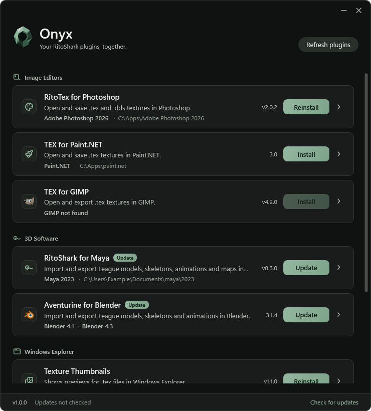
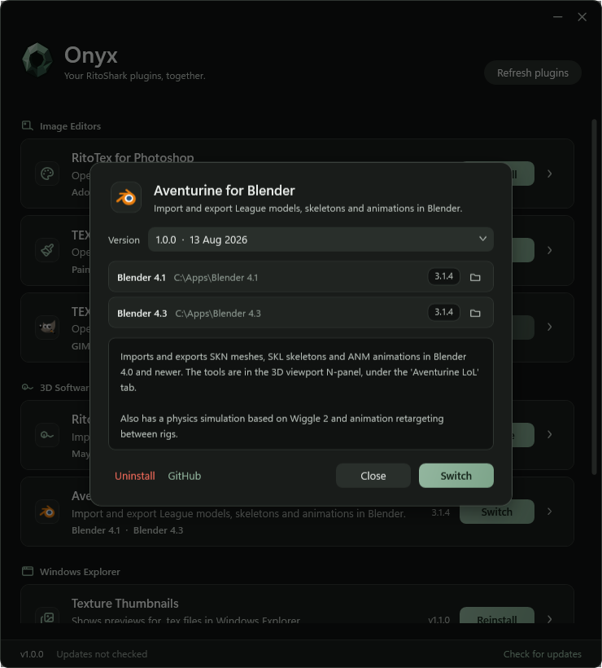
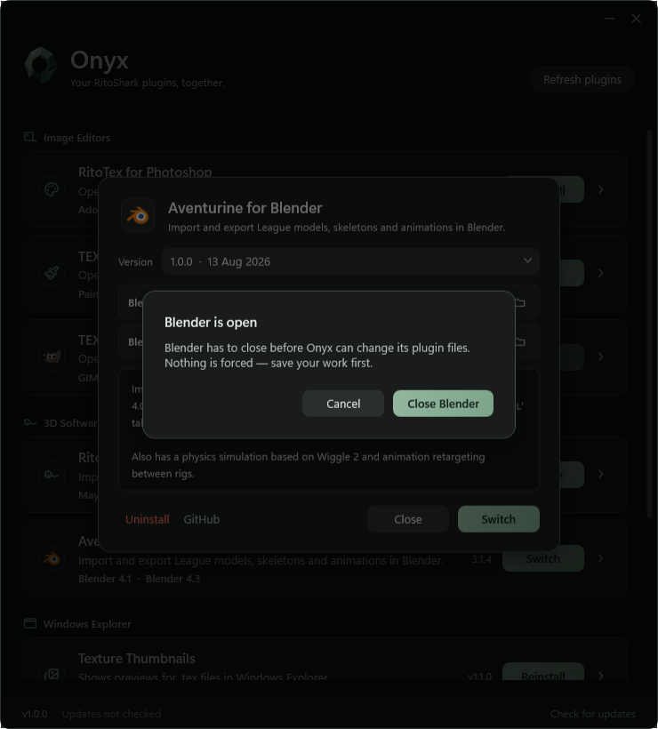

<div align="center">


<h1>Onyx</h1>

[](https://dotnet.microsoft.com/)
[](https://github.com/RitoShark/Onyx/releases)
[](#download)
[](https://github.com/RitoShark/Onyx/releases/latest)
[](LICENSE)

[Download](#download) · [Features](#features) · [Supported tools](#supported-tools) · [Building](#building) · [License](#license)

</div>

---

Open Onyx and manage your RitoShark plugins in one window. It finds your image editors
and 3D software, installs the right files, and keeps track of what it changed. Update
to the latest release, go back to an older version, or remove a plugin when you no
longer need it.

---

## Features

Screenshots show the actual Onyx interface with example versions and folders.

<details open>
<summary><b>Your plugins, together</b> · one place to install and update</summary>

<br>



See your plugins grouped by the software they belong to, with installed versions and
available updates beside each one.

- **Install** downloads the plugin and puts its files in the right place.
- **Update** defaults to the latest stable release.
- **Reinstall** writes the same version again when you need a fresh copy.
- Missing software is clearly marked. Open its details and choose a folder if your
  installation was not detected.

The bottom bar checks for updates to Onyx itself. When a newer stable version is
available, **Download** opens its release page. **Refresh plugins** checks the
managed plugins separately.

<br clear="all">

</details>

<details>
<summary><b>Version control</b> · pick the release you need</summary>

<br>



Open a plugin's details to see what it does, which folders it targets, and the
available releases.

- Choose an older release to downgrade, or select an available prerelease yourself.
- The button reflects your selection: **Update**, **Reinstall**, or **Switch**.
- Multiple detected versions of the same host stay inside one plugin entry. Onyx
  applies the selected plugin release across its supported targets.
- Open a target folder or the plugin's GitHub repository directly from the dialog.

<br clear="all">

</details>

<details>
<summary><b>Installation and removal</b> · keep track of what changes</summary>

<br>



If a host application is open, Onyx asks you to save your work and close it before
changing its plugin files. It does not force-quit your editor.

- Installation records track the files Onyx wrote, so uninstall can remove those files.
- Windows asks for administrator access when the target folder or registration needs it.
- Explorer thumbnail handlers may require restarting Explorer to unload a DLL.
- Conflicting thumbnail providers are marked so you can remove one before installing the other.

<br clear="all">

</details>

---

## Download

Get `Onyx.exe` from [Releases](https://github.com/RitoShark/Onyx/releases) and run it
on 64-bit Windows. No installer, separate .NET runtime, or companion DLLs are needed.
You can keep the executable in any folder, including a USB drive.

To update Onyx, close it and replace the executable with the new one.

### Where data lives

Onyx is portable in the **no installation required** sense. Its data stays on the PC
under `%LOCALAPPDATA%\RitoShark\Onyx`:

| Data | File or folder |
| --- | --- |
| Plugin installation records | `state.json` |
| Manually chosen host folders | `hosts.json` |
| Saved catalog | `catalog.json` |
| Release cache | `releases/` |

Moving the EXE does not move these records or the plugins installed into your editors.
Downloads use temporary storage, and the bundled runtime extracts native components
when needed. Internet access is needed to fetch releases and plugin files. If Onyx's
release repository cannot be reached or is private, the footer reports that its
update check is unavailable.

## Supported tools

| Plugin or tool | Target |
| --- | --- |
| RitoTex for Photoshop | 64-bit Photoshop CS6 and newer |
| TEX for Paint.NET | Paint.NET, classic and Store layouts |
| TEX for GIMP | GIMP 2 and GIMP 3, with the matching build for each |
| RitoShark for Maya | Maya 2023 and newer |
| Aventurine for Blender | Blender 4.0 and newer |
| Texture Thumbnails | Windows Explorer |
| LTK Thumbnails | Alternative Explorer thumbnail provider |
| Hematite | Standalone skin repair tool |

The supported plugins and their install steps live in
[`catalog.json`](Onyx.Core/Catalog/catalog.json).

## Building

<details>
<summary><b>Build the portable EXE</b></summary>

<br>

Needs the .NET 9 SDK on Windows. These are the build commands for Onyx:

```powershell
git clone https://github.com/RitoShark/Onyx.git
cd Onyx
dotnet test
dotnet run --project Onyx
powershell -NoProfile -ExecutionPolicy Bypass -File scripts/Build-Portable.ps1
```

The portable build is `artifacts/portable/Onyx.exe`. Distribute that file by itself.
The build script bundles the runtime and omits separate debug symbols.

</details>

<details>
<summary><b>Refresh screenshots and branding</b></summary>

<br>

```powershell
dotnet run --project scripts/Screenshots/Screenshots.csproj -c Release -- docs/shots
powershell -NoProfile -ExecutionPolicy Bypass -File scripts/Build-BrandAssets.ps1
```

The screenshot utility renders the WPF interface with fixed example data. It does
not download releases, install plugins, or change host folders.

Theme colors live in [`Onyx.xaml`](Onyx/Theme/Onyx.xaml). The
[`SVG logo`](Onyx/Assets/onyx-logo.svg) is the source for the WPF drawing, PNG, and
Windows icon.

</details>

## Contributing

See [CONTRIBUTING.md](CONTRIBUTING.md), follow the
[Code of Conduct](CODE_OF_CONDUCT.md), and report security issues as described in
[SECURITY.md](SECURITY.md).

## License

[AGPL-3.0](LICENSE).
